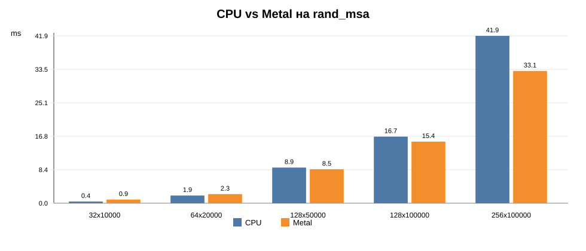

# Benchmark CPU vs Metal на rand_msa

Для оценки производительности Metal backend-а был проведен benchmark на случайно сгенерированных множественных выравниваниях, созданных через `MSA.random` по тому же принципу, что используется в сценарии `rand_msa`. В каждом измерении дерево слегка масштабировалось, чтобы `GenericLikelihood` не возвращал закэшированное значение, а выполнял реальный пересчет likelihood. Для Metal использовался размер threadgroup 256, перед измерениями выполнялось 3 прогревочных запуска, затем 10 измеряемых итераций.

| Число последовательностей x сайтов | Уникальных паттернов | CPU, мс | Metal, мс | Ускорение Metal | abs diff likelihood |
|---:|---:|---:|---:|---:|---:|
| 32 x 10000 | 10000 | 0.42 | 0.90 | 0.46x | 0.004412 |
| 64 x 20000 | 20000 | 1.92 | 2.26 | 0.85x | 0.009657 |
| 128 x 50000 | 50000 | 8.92 | 8.49 | 1.05x | 0.032599 |
| 128 x 100000 | 100000 | 16.66 | 15.42 | 1.08x | 0.065514 |
| 256 x 100000 | 100000 | 41.88 | 33.10 | 1.27x | 0.027088 |

По результатам измерений Metal backend уступает CPU на меньших выравниваниях из-за накладных расходов на запуск GPU kernel-а и синхронизацию. На более крупных наборах данных разница уменьшается, а для случая 256 x 100000 Metal показывает ускорение примерно 1.27x. Расхождение likelihood остается малым относительно абсолютного значения логарифма правдоподобия и связано с использованием `float32` в Metal kernel-е.
