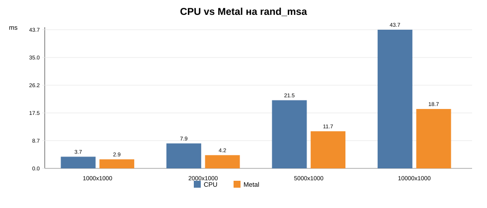

# Benchmark CPU vs Metal на rand_msa (с большим числом последовательностей)

| Число последовательностей x сайтов | Уникальных паттернов | CPU, мс | Metal, мс | Ускорение Metal | abs diff likelihood |
|---:|---:|---:|---:|---:|---:|
| 1000 x 1000 | 1000 | 3.68 | 2.86 | 1.29x | 0.001817 |
| 2000 x 1000 | 1000 | 7.87 | 4.17 | 1.89x | 0.005864 |
| 5000 x 1000 | 1000 | 21.48 | 11.70 | 1.84x | 0.014308 |
| 10000 x 1000 | 1000 | 43.70 | 18.72 | 2.33x | 0.027386 |

В этой серии Metal показывает более заметное преимущество, потому что вычисления лучше загружают GPU: при `1000 x 1000` ускорение составляет примерно `1.29x`, а при `10000 x 1000` достигает примерно `2.33x`. Это подтверждает, что текущая реализация Metal backend-а особенно полезна на выравниваниях с большим числом последовательностей, где растет количество внутренних узлов дерева и объем вычисления частичных правдоподобий.
